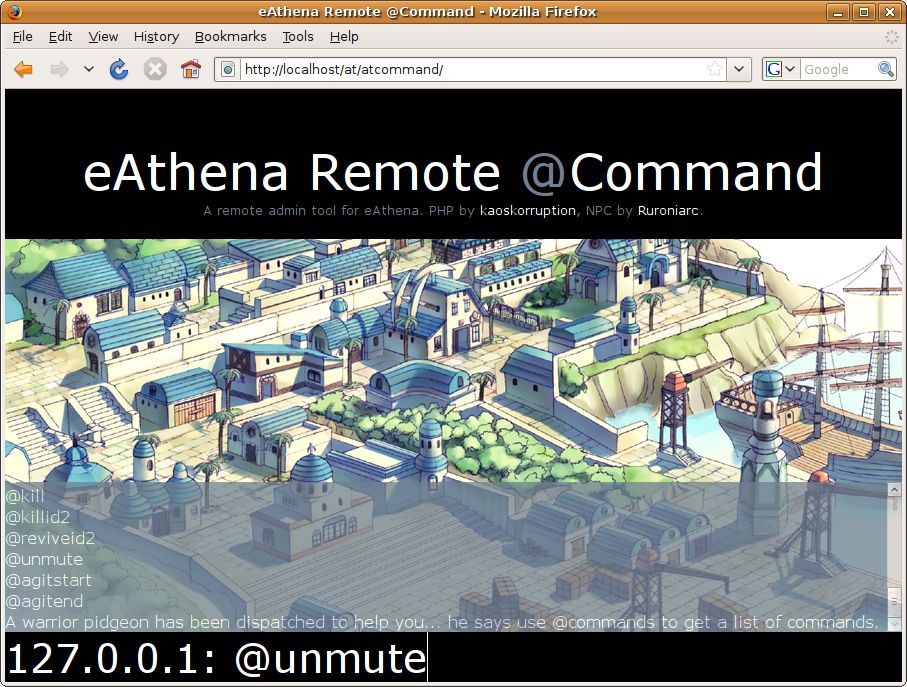

# eAthena Remote @Command

This was a project that **ruroniarc** and I (**kaoskorruption**) built dating back to the mid 2000's. I don't even know what year we wrote it anymore, but it was a fun project. I'm throwing it up on GitHub for memory's sake.

This script is to run *@commands* from a web interface. Currently you can use any command that doesn't send information back to the client. For instance, `@whodrops` won't work because it shows information. `@kill`, on the other hand, works just fine. This script is basically made for using commands like `@ban` and `@banfor`, so that you can ban a username while you're not near your computer. We hope you enjoy our release.

---

## Install

**This script is only for SQL-Based eAthena Servers. It will not work on text-based servers!**

1. Execute `/setup/commands.sql` to create the commands database and the commands table.
2. Move `/setup/commands.txt` to your npc folder or your favorite sub-directory there-of.
3. Add `npc: npc/commands.txt` to your `scripts_custom.conf`.
4. Restart your server (The server needs to be restarted because this script uses the OnInit: call, and that requires the server to reboot.
5. Add the `atcommand` folder to your website. Add a `.htaccess` file to this and don't give anyone you don't want executing commands on your server the username/password.
6. Modify the variables in `settings.php` to reflect your MySQL database server. Defaults under the other settings should work just fine for normal usage although you may choose to raise or lower the variable for the GM level in which the commands may be used. A list of the commands and their levels are available in the atcommand_athena.conf file or by typing *@commands* (The `charcommand_athena.conf` file is currently in there, but doesn't actually do anything.)

## Known Bugs & Limitations

1. This script currently displays `[Debug]: mapindex_id2name: Requested name for non-existant map index [0] in cache.` in the map-server console every time the script runs a command. This currently doesn't affect anything, so I guess it's not a big deal.
2. You can't currently use *#charcommands*, that will come in the next release.

## Authors

This script was coded by **kaoskorruption** (PHP) and **ruroniarc** (Lua) for the eAthena community.

## License

The script is released under an MIT License.
